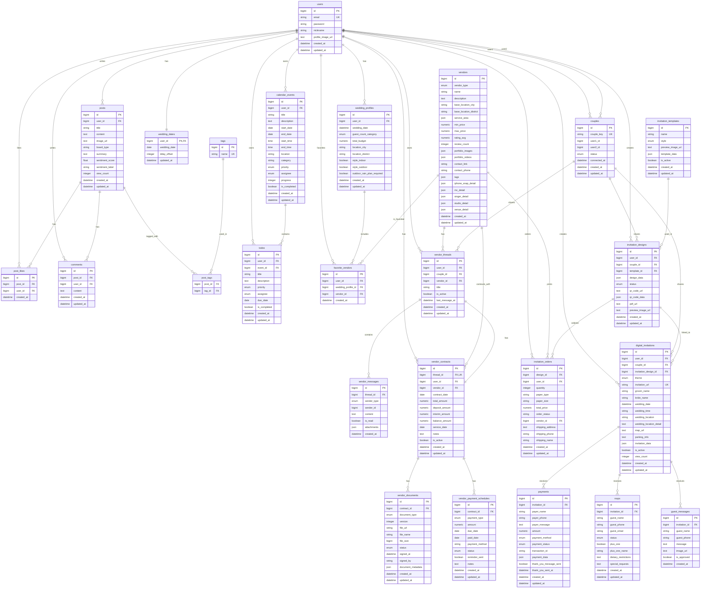

# Wedding OS Database ERD

```mermaid
erDiagram
    users {
        bigint id PK
        string email UK
        string password
        string nickname
        text profile_image_url
        datetime created_at
        datetime updated_at
    }

    posts {
        bigint id PK
        bigint user_id FK
        string title
        text content
        text image_url
        string board_type
        text summary
        float sentiment_score
        string sentiment_label
        integer view_count
        datetime created_at
        datetime updated_at
    }

    post_likes {
        bigint id PK
        bigint post_id FK
        bigint user_id FK
        datetime created_at
    }

    comments {
        bigint id PK
        bigint post_id FK
        bigint user_id FK
        text content
        datetime created_at
        datetime updated_at
    }

    tags {
        bigint id PK
        string name UK
    }

    post_tags {
        bigint post_id FK
        bigint tag_id FK
    }

    calendar_events {
        bigint id PK
        bigint user_id FK
        string title
        text description
        date start_date
        date end_date
        time start_time
        time end_time
        string location
        string category
        enum priority
        enum assignee
        integer progress
        boolean is_completed
        datetime created_at
        datetime updated_at
    }

    todos {
        bigint id PK
        bigint user_id FK
        bigint event_id FK
        string title
        text description
        enum priority
        enum assignee
        date due_date
        boolean is_completed
        datetime created_at
        datetime updated_at
    }

    wedding_dates {
        bigint user_id PK,FK
        date wedding_date
        integer dday_offset
        datetime updated_at
    }

    wedding_profiles {
        bigint id PK
        bigint user_id FK
        datetime wedding_date
        enum guest_count_category
        numeric total_budget
        string location_city
        string location_district
        boolean style_indoor
        boolean style_outdoor
        boolean outdoor_rain_plan_required
        datetime created_at
        datetime updated_at
    }

    vendors {
        bigint id PK
        enum vendor_type
        string name
        text description
        string base_location_city
        string base_location_district
        json service_area
        numeric min_price
        numeric max_price
        numeric rating_avg
        integer review_count
        json portfolio_images
        json portfolio_videos
        string contact_link
        string contact_phone
        json tags
        json iphone_snap_detail
        json mc_detail
        json singer_detail
        json studio_detail
        json venue_detail
        datetime created_at
        datetime updated_at
    }

    favorite_vendors {
        bigint id PK
        bigint user_id FK
        bigint wedding_profile_id FK
        bigint vendor_id FK
        datetime created_at
    }

    couples {
        bigint id PK
        string couple_key UK
        bigint user1_id
        bigint user2_id
        enum status
        datetime connected_at
        datetime created_at
        datetime updated_at
    }

    vendor_threads {
        bigint id PK
        bigint user_id FK
        bigint couple_id FK
        bigint vendor_id FK
        string title
        boolean is_active
        datetime last_message_at
        datetime created_at
        datetime updated_at
    }

    vendor_messages {
        bigint id PK
        bigint thread_id FK
        enum sender_type
        bigint sender_id
        text content
        boolean is_read
        json attachments
        datetime created_at
    }

    vendor_contracts {
        bigint id PK
        bigint thread_id FK,UK
        bigint user_id FK
        bigint vendor_id FK
        date contract_date
        numeric total_amount
        numeric deposit_amount
        numeric interim_amount
        numeric balance_amount
        date service_date
        text notes
        boolean is_active
        datetime created_at
        datetime updated_at
    }

    vendor_documents {
        bigint id PK
        bigint contract_id FK
        enum document_type
        integer version
        string file_url
        string file_name
        bigint file_size
        enum status
        datetime signed_at
        string signed_by
        json document_metadata
        datetime created_at
        datetime updated_at
    }

    vendor_payment_schedules {
        bigint id PK
        bigint contract_id FK
        enum payment_type
        numeric amount
        date due_date
        date paid_date
        string payment_method
        enum status
        boolean reminder_sent
        text notes
        datetime created_at
        datetime updated_at
    }

    invitation_templates {
        bigint id PK
        string name
        enum style
        text preview_image_url
        json template_data
        boolean is_active
        datetime created_at
        datetime updated_at
    }

    invitation_designs {
        bigint id PK
        bigint user_id FK
        bigint couple_id FK
        bigint template_id FK
        json design_data
        enum status
        text qr_code_url
        json qr_code_data
        text pdf_url
        text preview_image_url
        datetime created_at
        datetime updated_at
    }

    invitation_orders {
        bigint id PK
        bigint design_id FK
        bigint user_id FK
        integer quantity
        string paper_type
        string paper_size
        numeric total_price
        string order_status
        bigint vendor_id FK
        text shipping_address
        string shipping_phone
        string shipping_name
        datetime created_at
        datetime updated_at
    }

    digital_invitations {
        bigint id PK
        bigint user_id FK
        bigint couple_id FK
        bigint invitation_design_id FK
        enum theme
        string invitation_url UK
        string groom_name
        string bride_name
        datetime wedding_date
        string wedding_time
        string wedding_location
        text wedding_location_detail
        text map_url
        text parking_info
        json invitation_data
        boolean is_active
        integer view_count
        datetime created_at
        datetime updated_at
    }

    payments {
        bigint id PK
        bigint invitation_id FK
        string payer_name
        string payer_phone
        text payer_message
        numeric amount
        enum payment_method
        enum payment_status
        string transaction_id
        json payment_data
        boolean thank_you_message_sent
        datetime thank_you_sent_at
        datetime created_at
        datetime updated_at
    }

    rsvps {
        bigint id PK
        bigint invitation_id FK
        string guest_name
        string guest_phone
        string guest_email
        enum status
        boolean plus_one
        string plus_one_name
        text dietary_restrictions
        text special_requests
        datetime created_at
        datetime updated_at
    }

    guest_messages {
        bigint id PK
        bigint invitation_id FK
        string guest_name
        string guest_phone
        text message
        text image_url
        boolean is_approved
        datetime created_at
    }

    users ||--o{ posts : "writes"
    users ||--o{ comments : "writes"
    users ||--o{ post_likes : "likes"
    users ||--o{ calendar_events : "owns"
    users ||--o{ todos : "owns"
    users ||--|| wedding_dates : "has"
    users ||--o{ wedding_profiles : "has"
    users ||--o{ favorite_vendors : "favorites"
    users ||--o{ couples : "user1"
    users ||--o{ couples : "user2"
    users ||--o{ vendor_threads : "owns"
    users ||--o{ vendor_contracts : "has"
    users ||--o{ invitation_designs : "creates"
    users ||--o{ invitation_orders : "orders"
    users ||--o{ digital_invitations : "creates"

    posts ||--o{ comments : "has"
    posts ||--o{ post_likes : "has"
    posts ||--o{ post_tags : "tagged_with"
    tags ||--o{ post_tags : "used_in"

    calendar_events ||--o{ todos : "contains"

    wedding_profiles ||--o{ favorite_vendors : "includes"
    vendors ||--o{ favorite_vendors : "is_favorited"
    vendors ||--o{ vendor_threads : "has"
    vendors ||--o{ vendor_contracts : "contracts_with"
    vendors ||--o{ invitation_orders : "prints"

    couples ||--o{ vendor_threads : "shares"
    couples ||--o{ invitation_designs : "shares"
    couples ||--o{ digital_invitations : "shares"

    vendor_threads ||--o{ vendor_messages : "contains"
    vendor_threads ||--|| vendor_contracts : "has"

    vendor_contracts ||--o{ vendor_documents : "has"
    vendor_contracts ||--o{ vendor_payment_schedules : "has"

    invitation_templates ||--o{ invitation_designs : "used_in"

    invitation_designs ||--o{ invitation_orders : "ordered"
    invitation_designs ||--o{ digital_invitations : "linked_to"

    digital_invitations ||--o{ payments : "receives"
    digital_invitations ||--o{ rsvps : "receives"
    digital_invitations ||--o{ guest_messages : "receives"
```
