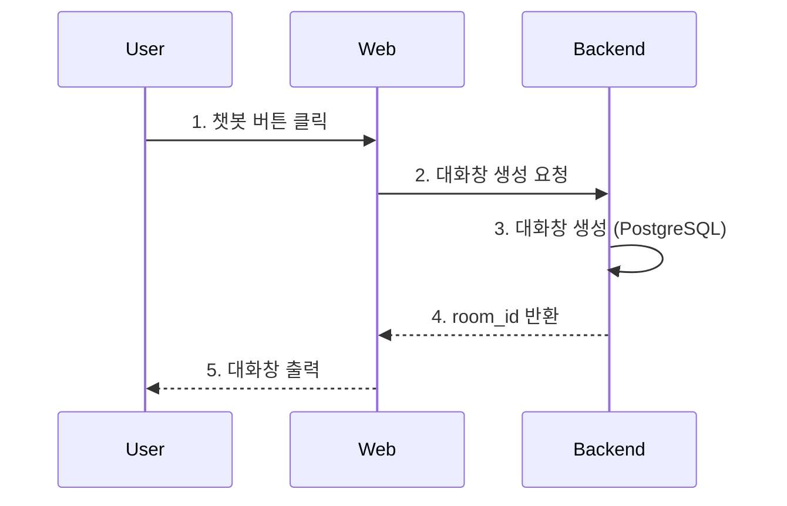
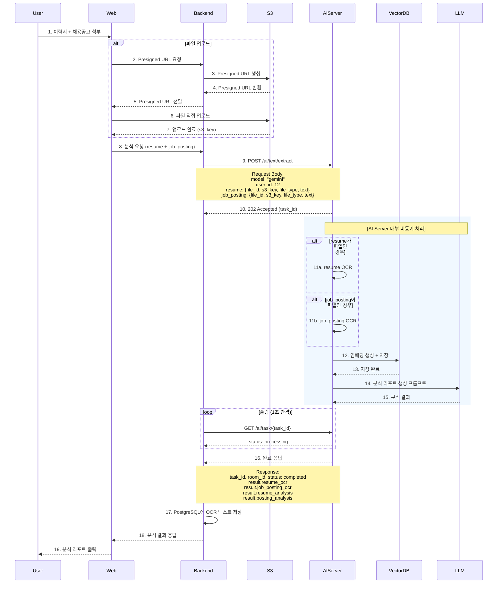
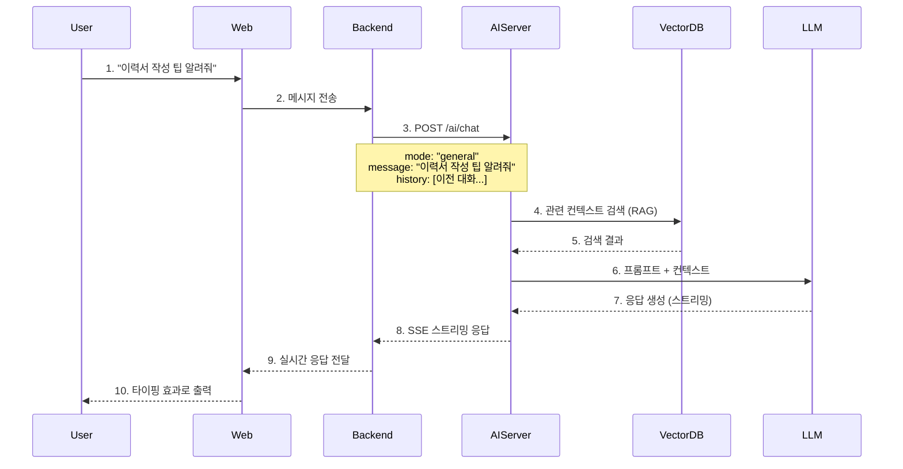
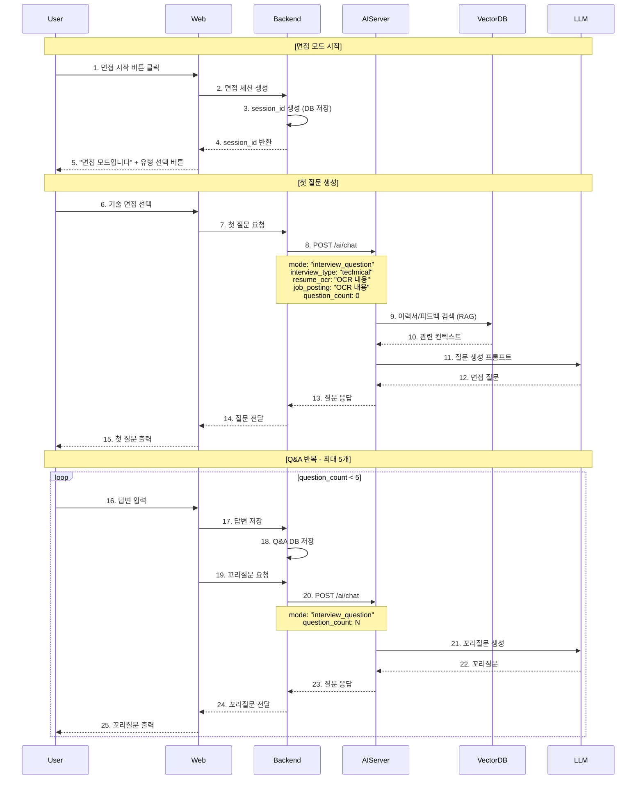
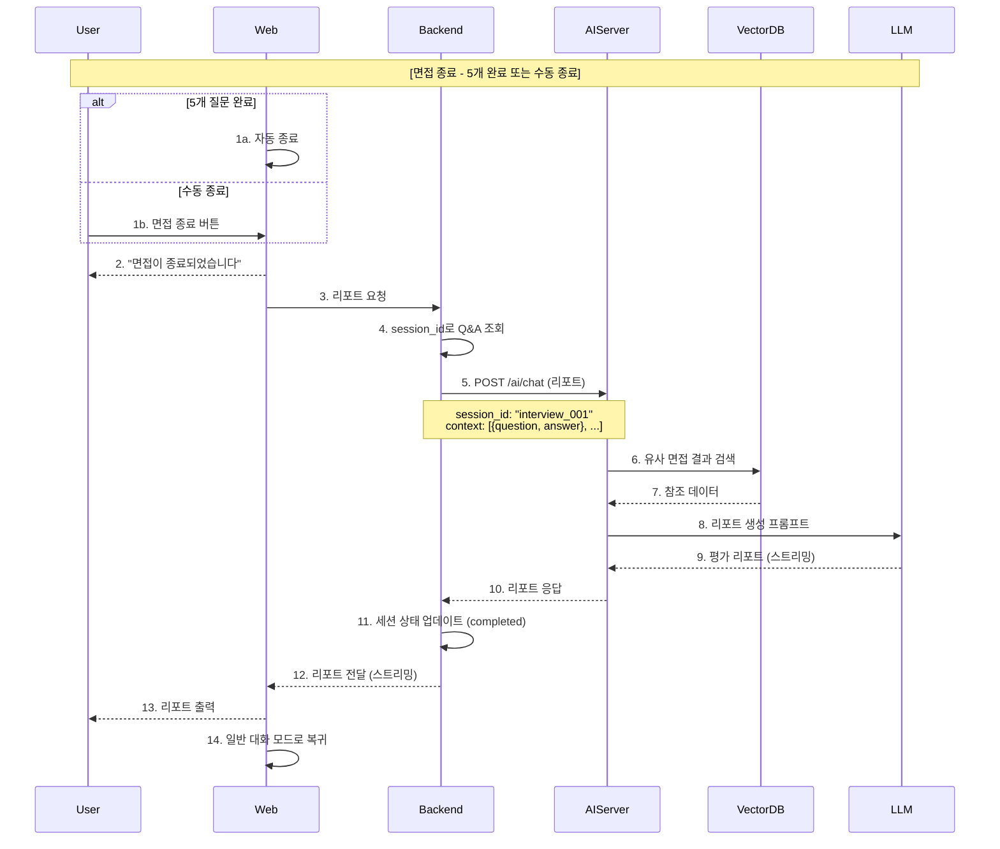
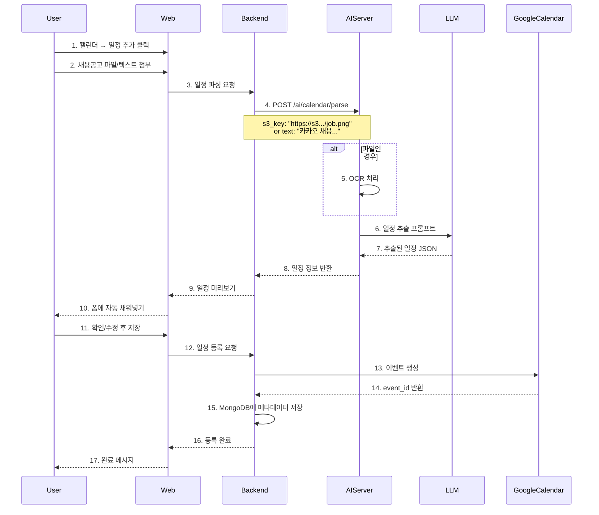
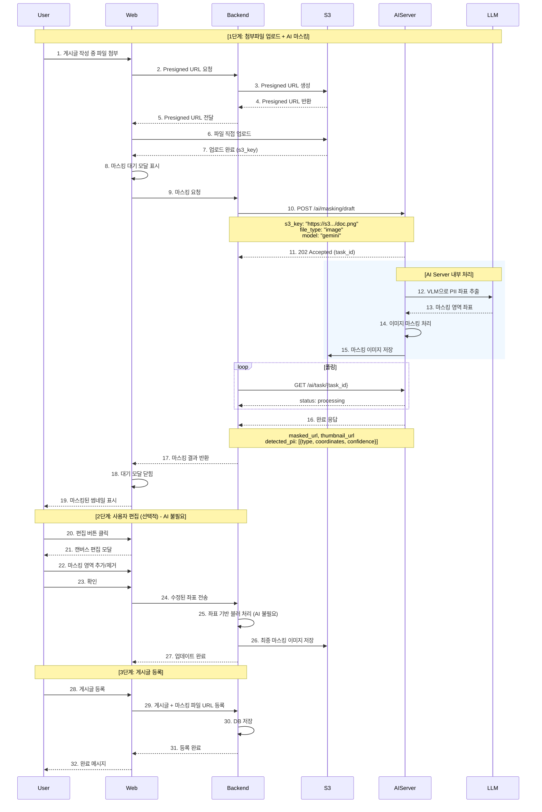

# AI 서비스 API 흐름도

서비스 시나리오 기반 시퀀스 다이어그램
**AI Server API 5개 기준으로 재구성**

---

## 목차

- [1. 대화창 생성](#1-대화창-생성)
- [2. 이력서/채용공고 텍스트 추출 + 분석](#2-이력서채용공고-텍스트-추출--분석)
- [3. 일반 채팅 (RAG)](#3-일반-채팅-rag)
- [4. 모의면접 - 질문 생성](#4-모의면접---질문-생성)
- [5. 모의면접 - 리포트 생성](#5-모의면접---리포트-생성)
- [6. 캘린더 일정 파싱](#6-캘린더-일정-파싱)
- [7. 게시판 첨부파일 마스킹](#7-게시판-첨부파일-마스킹)
- [API Endpoint 요약](#api-endpoint-요약)

---

## 1. 대화창 생성

**Backend Endpoint:** `POST /api/chat/rooms`

> AI Server 호출 없음 (Backend만 처리)



---

## 2. 이력서/채용공고 텍스트 추출 + 분석

**사용 AI API:**
- `POST /ai/text/extract` - 텍스트 추출 + 임베딩 저장 + 분석 (비동기)
- `GET /ai/task/{task_id}` - 작업 상태 폴링

> **핵심:** resume + job_posting을 함께 전송하면 OCR → 임베딩 → 분석 리포트까지 한번에 처리



### Request/Response 예시

**Request (POST /ai/text/extract):**
```json
{
    "model": "gemini",
    "room_id": 23,
    "user_id": 12,
    "resume": {
        "file_id": 23,
        "s3_key": "https://bucket.s3.amazonaws.com/users/12/resume/abc123.pdf",
        "file_type": "application/pdf",
        "text": null
    },
    "job_posting": {
        "file_id": null,
        "s3_key": null,
        "file_type": null,
        "text": "카카오 백엔드 개발자 채용\n자격요건: Java, Spring..."
    }
}
```

**Response (GET /ai/task/{task_id} - 완료 시):**
```json
{
    "task_id": 12,
    "room_id": 32,
    "status": "completed",
    "result": {
        "success": true,
        "resume_ocr": "이력서 OCR 텍스트...",
        "job_posting_ocr": "채용공고 OCR 텍스트...",
        "resume_analysis": {
            "strengths": ["React 숙련도", "프로젝트 경험"],
            "weaknesses": ["백엔드 경험 부족"],
            "suggestions": ["Spring 학습 권장"]
        },
        "posting_analysis": {
            "company": "카카오",
            "position": "백엔드 개발자",
            "required_skills": ["Java", "Spring", "MySQL"],
            "preferred_skills": ["Docker", "Kubernetes"]
        }
    }
}
```

---

## 3. 일반 채팅 (RAG)

**사용 AI API:**
- `POST /ai/chat` - context.mode: "general" (스트리밍 SSE)

> **핵심:** VectorDB에서 관련 컨텍스트 검색 후 LLM 응답 생성



### Request/Response 예시

**Request:**
```json
{
    "model": "gemini",
    "room_id": 1,
    "user_id": 12,
    "message": "이력서 작성 팁 알려줘",
    "session_id": null,
    "context": {
        "mode": "general",
        "resume_ocr": null,
        "job_posting_ocr": null,
        "interview_type": null,
        "question_count": null
    }
}
```

**Response (SSE):**
```json
{
    "success": true,
    "mode": "general",
    "response": "이력서 작성 팁을 알려드릴게요..."
}
```

---

## 4. 모의면접 - 질문 생성

**사용 AI API:**
- `POST /ai/chat` - context.mode: "interview_question" (스트리밍 SSE)

> **핵심:** 이력서 + 채용공고 기반 면접 질문/꼬리질문 생성



### Request/Response 예시

**Request (면접 질문 생성):**
```json
{
    "model": "gemini",
    "room_id": 1,
    "user_id": 12,
    "message": "기술 면접 질문 생성해줘",
    "session_id": 23,
    "context": {
        "mode": "interview_question",
        "resume_ocr": "OCR 내용",
        "job_posting_ocr": "OCR 내용",
        "interview_type": "technical",
        "question_count": 0
    }
}
```

**Response:**
```json
{
    "success": true,
    "mode": "interview_question",
    "response": "React와 Vue의 차이점에 대해 설명해주세요.",
    "interview_type": "technical"
}
```

---

## 5. 모의면접 - 리포트 생성

**사용 AI API:**
- `POST /ai/chat` - 면접 종료 시 평가 리포트 생성 (스트리밍 SSE)

> **핵심:** 전체 Q&A 히스토리 기반 종합 평가 및 피드백



### Request/Response 예시

**Request (면접 리포트):**
```json
{
    "model": "gemini",
    "room_id": 1,
    "user_id": 12,
    "session_id": 23,
    "context": [
        {
            "question": "~~",
            "answer": "...."
        }
    ]
}
```

**Response:**
```json
{
    "success": true,
    "mode": "interview_report",
    "report": {
        "evaluations": [
            {
                "question": "React의 Virtual DOM이 무엇인가요?",
                "answer": "실제 DOM과 비교해서 변경된 부분만 업데이트하는 거예요",
                "good_points": ["Virtual DOM의 기본 개념을 잘 이해하고 있음"],
                "improvements": ["Reconciliation 알고리즘 설명 추가하면 좋음"]
            }
        ],
        "strength_patterns": ["기술 개념에 대한 이해도가 높음"],
        "weakness_patterns": ["심화 개념 설명이 부족함"],
        "learning_guide": ["React 심화 개념 학습 (Fiber, Concurrent Mode)"]
    }
}
```

---

## 6. 캘린더 일정 파싱

**사용 AI API:**
- `POST /ai/calendar/parse` - 일정 정보 추출 (동기)

> 챗봇이 아닌 **캘린더 모달**에서 파일 분석 시 사용



### Request/Response 예시

**Request:**
```json
{
    "s3_key": "https://s3.../job_posting.png",
    "text": null
}
```

또는

```json
{
    "s3_key": null,
    "text": "카카오 백엔드 개발자 채용\n서류마감: 2026-01-15\n코딩테스트: 2026-01-20..."
}
```

**Response (200 OK):**
```json
{
    "success": true,
    "company": "카카오",
    "position": "백엔드 개발자",
    "schedules": [
        { "stage": "서류 마감", "date": "2026-01-15", "time": null },
        { "stage": "코딩테스트", "date": "2026-01-20", "time": "14:00" },
        { "stage": "1차 면접", "date": "2026-01-25", "time": null }
    ],
    "hashtags": ["#카카오", "#백엔드", "#신입"]
}
```

---

## 7. 게시판 첨부파일 마스킹

**사용 AI API:**
- `POST /ai/masking/draft` - 1차 개인정보 마스킹 (비동기)
- `GET /ai/task/{task_id}` - 작업 상태 폴링

> 게시글 작성 시 첨부파일에서 개인정보 자동 마스킹



### Request/Response 예시

**Request (POST /ai/masking/draft):**
```json
{
    "s3_key": "https://s3.../document.png",
    "file_type": "image",
    "model": "gemini"
}
```

**Response (202 Accepted):**
```json
{
    "task_id": 32,
    "status": "processing"
}
```

**Polling 완료 시 (GET /ai/task/{task_id}):**
```json
{
    "task_id": 32,
    "status": "completed",
    "result": {
        "success": true,
        "original_url": "https://s3.../document.png",
        "masked_url": "https://s3.../document_masked.png",
        "thumbnail_url": "https://s3.../document_masked_thumb.png",
        "detected_pii": [
            { "type": "name", "coordinates": [100, 50, 200, 80], "confidence": 0.95 },
            { "type": "phone", "coordinates": [100, 100, 250, 130], "confidence": 0.92 },
            { "type": "email", "coordinates": [100, 150, 300, 180], "confidence": 0.98 },
            { "type": "face", "coordinates": [400, 50, 500, 150], "confidence": 0.99 }
        ]
    }
}
```

---

## API Endpoint 요약

### AI Server API (FastAPI) - 총 5개

> **API 버전**: v1.7 (2026-01-27 업데이트)

| # | Endpoint | Method | 설명 | 처리방식 |
|---|----------|--------|------|----------|
| 1 | `/ai/text/extract` | POST | OCR + 임베딩 + 분석 리포트 (통합) | 비동기 |
| 2 | `/ai/chat` | POST | 채팅 (general/interview_question/interview_report) | 스트리밍 (SSE) |
| 3 | `/ai/calendar/parse` | POST | 캘린더 일정 파싱 | 동기 |
| 4 | `/ai/masking/draft` | POST | 게시판 첨부파일 마스킹 | 비동기 |
| 5 | `/ai/task/{task_id}` | GET | 비동기 작업 상태 조회 | 동기 |

### /ai/chat 모드별 기능

| Mode | 설명 | 주요 파라미터 |
|------|------|--------------|
| `general` | 일반 대화 + RAG | message, history |
| `interview_question` | 면접 질문/꼬리질문 생성 | resume_ocr, job_posting, interview_type, session_id, question_count |
| `interview_report` | 면접 평가 리포트 생성 | session_id, context (Q&A 배열) |

### Backend API ↔ AI API 매핑

| Backend 외부 API | AI Server 내부 API | 설명 |
|-----------------|-------------------|------|
| `POST /api/chat/rooms` | 없음 | 대화창 생성 (Backend만) |
| `POST /api/ai/chatrooms/{roomId}/analysis` | `POST /ai/text/extract` | 분석 요청 |
| `POST /api/ai/chatrooms/{roomId}/messages` | `POST /ai/chat` (general) | 일반 채팅 |
| `POST /api/ai/chatrooms/{roomId}/interview` | `POST /ai/chat` (interview_question) | 면접 질문 |
| `POST /api/ai/chatrooms/{roomId}/evaluation` | `POST /ai/chat` (interview_report) | 면접 평가 |
| `POST /api/ai/events/extraction` | `POST /ai/calendar/parse` | 일정 추출 |
| `POST /api/board/upload` | `POST /ai/masking/draft` | 마스킹 요청 |

### 처리방식 설명

| 방식 | 설명 | 사용 시점 |
|------|------|----------|
| **동기** | 요청 → 응답 대기 → 완료 | 빠른 처리 (1-2초) |
| **비동기** | 요청 → task_id 반환 → 폴링 | 오래 걸리는 처리 (파일 등) |
| **스트리밍** | SSE로 실시간 응답 | 대화형 UX (타이핑 효과) |

---

**문서 버전:** v1.7
**마지막 업데이트:** 2026-01-27
