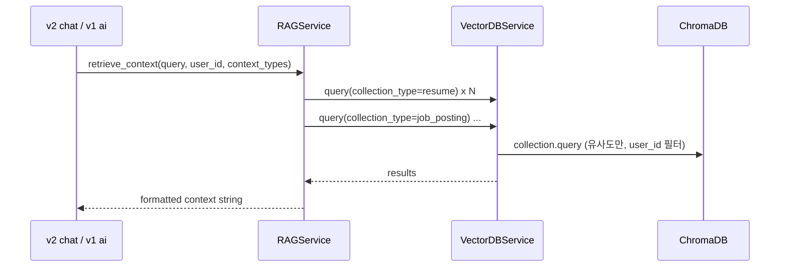

# ADR 051-055: 모의 면접 답변·질문 생성 방식

> **작성일:** 2026-02-09  
> **상태:** 승인됨 (Accepted)

---

## 📚 목차

- [ADR-051: 모의 면접 질문 생성 방식 변경 (다회 개별 호출 → 1회 배치 생성)](#adr-051-모의-면접-질문-생성-방식-변경-다회-개별-호출--1회-배치-생성)
- [ADR-052: 프롬프트 관리 방식 진화 (코드 내장 → 마크다운 → 시스템+마크다운 → 인젝션 방어 → YAML)](#adr-052-프롬프트-관리-방식-진화-코드-내장--마크다운--시스템마크다운--인젝션-방어--yaml)
- [ADR-053: 채팅 대화 맥락(history) 실제 반영 (Gemini·LCEL 경로)](#adr-053-채팅-대화-맥락history-실제-반영-gemini-lcel-경로)
- [ADR-054: RAG 리트리버 확장 (RAGChain.retrieve_context + MMR)](#adr-054-rag-리트리버-확장-ragchainretrieve_context--mmr)

---

## ADR-051: 모의 면접 질문 생성 방식 변경 (다회 개별 호출 → 1회 배치 생성)

### 📋 메타데이터

| 항목 | 내용 |
|------|------|
| **상태** | ✅ 승인됨 (Accepted) |
| **작성일** | 2026-02-09 |
| **결정자** | AI팀 |
| **관련 기능** | 모의 면접, 질문 생성, 채팅 스트리밍(v1/v2), RAG |
| **관련 ADR** | [ADR-048](4.DOCS/1.ADR/[AI]%2009_ADR_%20046-050.md#adr-048-채팅면접-피드백-응답-방식-스트리밍-유지-vs-llm-다회-호출-배치) (채팅/면접 응답 방식), [ADR-050](4.DOCS/1.ADR/[AI]%2009_ADR_%20046-050.md#adr-050-rag면접-조회-병렬화-asynciogather-runnableparallel-불필요) (RAG·면접 조회 병렬화) |

---

### 🎯 컨텍스트 (Context)

모의 면접 시작 시 **초기 질문 5개**를 어떻게 생성할지에 따라 API 호출 횟수·비용·안정성이 달라진다.

**이전 방식 (v1):**
- 모의 면접 시작 시 **질문 5개를 각각 API 호출** (`create_interview_question_prompt` + `asked_questions`로 1개씩 생성) → LLM 호출 **5회**
- 이력서·채용공고 분석 1회, 마지막 피드백 1회를 포함하면 **총 7회** API 호출
- 그 결과:
  - 데이터 수신 불안정
  - 비용 증가
  - 외부 LLM rate limit 발생

**요구사항:**
- 모의 면접 시작 시 초기 5개 질문을 **안정적으로** 생성
- 호출 횟수·비용·rate limit 리스크 감소
- 질문 품질 유지 (공통 CS + 이력서·채용공고 기반 균형)

---

### 🔍 선택지 분석 (Options)

#### Option 1: 1회 배치 생성 (초기 5개 한 번에) — 채택 ⭐

- **초기 5개 질문**: 단일 프롬프트 1회 호출로 JSON 배열(`questions`) 한 번에 생성
- **질문 구성 규칙** (프롬프트에 명시):
  - **2개**: 공통 CS (카테고리 1·2 — 네트워크/OS, DB/자료구조)
  - **3개**: 이력서·채용공고·포트폴리오 기반 (프로젝트 기술 심화 2종 + 기술적 태도/성장)
- **꼬리질문**: 답변 수신 후 기존처럼 **별도 호출**로 생성 (최대 depth 3), 진행 방식 유지

**참조 코드:**
- `app/prompts/templates/interview/tech_interview_init.md` — 5개 카테고리별 1개씩 JSON 출력 규칙
- `app/api/routes/v1/ai.py`, `app/api/routes/v2/chat.py` — PHASE 1에서 `create_tech_interview_init_prompt` 1회 호출 후 JSON 파싱하여 세션 생성

**RAG 배치 경로 (별도 API용):**  
`RAGService.generate_interview_questions_batch()` 는 **하이브리드** 방식(템플릿 3개 + LLM 2개, LLM 실패 시 템플릿 폴백)이며, LCEL 체인 분기 시 1회 LLM 호출로 2개 생성. VectorDB 조회는 [ADR-050](4.DOCS/1.ADR/[AI]%2009_ADR_%20046-050.md#adr-050-rag면접-조회-병렬화-asynciogather-runnableparallel-불필요) 에 따라 `asyncio.gather` 병렬화됨.

| 장점 | 단점 |
|------|------|
| API 호출 5회 → 1회로 감소, 비용·rate limit 완화 | 한 번의 응답이 커져 파싱 실패 시 폴백 필요 |
| 데이터 수신 안정성 향상 | - |
| 이력서·채용공고·포트폴리오를 한 번만 컨텍스트로 넘겨 일관된 질문 세트 생성 | - |

#### Option 2: 기존 유지 (질문당 1회 호출, 5회)

- 질문 1~5각각 `generate_interview_question` 호출

| 장점 | 단점 |
|------|------|
| 호출당 응답 크기 작음 | 5회 호출로 비용·지연·rate limit 문제 유지 |
| - | 데이터 수신 불안정 경험 있음 |

#### Option 3: 템플릿 전용 (LLM 0회)

- 5개 모두 템플릿/키워드 기반으로만 생성 (`InterviewTemplateService.generate_questions`)

| 장점 | 단점 |
|------|------|
| 비용·지연 최소 | 이력서·채용공고 맥락 반영이 약해 질문 다양성·품질 저하 |

---

### 결정 (Decision)

**Option 1 (1회 배치 생성)을 선택합니다.**

**근거:**
1. 사용자 경험 상 **5회 개별 호출**에서 데이터 수신 실패·비용·rate limit 문제가 발생했고, **1회 배치**로 전환 후 개선 목표 달성
2. 초기 5개를 **한 프롬프트**로 생성하면 이력서·채용공고·포트폴리오를 한 번만 컨텍스트에 넣어 **일관된 질문 세트**를 만들 수 있음
3. 프롬프트에서 **2개 CS + 3개 이력서/채용공고 기반**으로 구성 규칙을 두어 품질·균형을 보장
4. **꼬리질문**은 답변마다 맥락이 다르므로 기존처럼 별도 호출로 유지하는 것이 적절함

---

### Consequences (결과)

**긍정적 영향:**
- 모의 면접 시작 시 LLM 호출 **5회 → 1회**로 감소 → 비용·지연·rate limit 리스크 감소
- 초기 질문 수신 안정성 향상
- 동일 컨텍스트로 5개를 한 번에 생성해 질문 간 일관성 확보

**부정적 영향 / 트레이드오프:**
- 1회 응답이 길어지므로 JSON 파싱 실패 시 **폴백 메시지** 필요 (현재 코드에 `PARSE_FAILED` 등 에러 이벤트 처리 존재)

**후속 작업:**
- [ ] (선택) 꼬리질문 생성 품질·depth 전략 재검토 시 별도 ADR 검토

---

### 구현 이력 (3.model 커밋 기준)

| 커밋 | 날짜 | 내용 |
|------|------|------|
| `de43876` | 2026-02-03 | **채팅 면접**: 질문 1개씩 생성 → **초기 5개 1회 생성**으로 전환. `tech_interview_init.md`·`create_tech_interview_init_prompt` 도입, 세션 기반 5개 질문 세트 + 꼬리질문 흐름 |
| `017e20a` | 2026-02-07 | API routes v1/v2 분리. v1·v2 채팅 모두 동일하게 init 1회 방식 유지 |
| `64f93d2` | 2026-02-12 | `LLMService.generate_interview_questions_batch()` 추가(5개 한 번에). `RAGService` 배치 래퍼 추가. temperature/max_tokens 설정 중앙화 |
| `323b416` | 2026-02-14 | **RAG 배치 하이브리드**: `InterviewTemplateService` 도입 — 템플릿 3개(LLM 없음) + LLM 2개. LLM 실패 시 템플릿 폴백 |
| `704ffa1` | 2026-02-15 | LCEL 체인 분기 — 면접 질문 생성(단건/배치)·RAG QnA에서 LCEL 사용 가능 |
| `95ab7e9` | 2026-02-15 | RAG·면접 조회 병렬화 (asyncio.gather). [ADR-050](4.DOCS/1.ADR/[AI]%2009_ADR_%20046-050.md) 반영 |

---

### 이력

| 날짜 | 변경 내용 |
|------|----------|
| 2026-02-09 | 초기 작성 (v1 다회 개별 호출 → v2 1회 배치 생성, 꼬리질문 유지) |
| 2026-02-09 | 3.model 커밋 기록 반영 — 구현 이력 표 추가, RAG 배치 경로·ADR-050 참조 보완 |

---

## ADR-052: 프롬프트 관리 방식 진화 (코드 내장 → 마크다운 → 시스템+마크다운 → 인젝션 방어 → YAML)

### 📋 메타데이터

| 항목 | 내용 |
|------|------|
| **상태** | ✅ 승인됨 (Accepted) |
| **작성일** | 2026-02-09 |
| **결정자** | AI팀 |
| **관련 기능** | 프롬프트 관리, 면접/채팅/RAG/평가, 보안(프롬프트·로그 인젝션), LangChain |
| **관련 ADR** | [ADR-051](#adr-051-모의-면접-질문-생성-방식-변경-다회-개별-호출--1회-배치-생성) (질문 생성 방식) |

---

### 🎯 컨텍스트 (Context)

프로젝트 초기에는 프롬프트 문자열이 **코드에 직접 하드코딩**되어 있었고, 이후 **가독성·추적성·보안** 요구에 따라 단계적으로 관리 방식을 바꿨다.

**진화 단계 요약:**

| 단계 | 방식 | 특징 |
|------|------|------|
| 1 | 코드 내장 | 프롬프트 문자열이 `interview.py`, `rag_service.py` 등 코드 내 상수/문자열로 존재. 수정 시 코드 배포 필요. |
| 2 | 마크다운 관리 시작 | `app/prompts/` 디렉터리 추가. `interview.py`, `chat.py`에서 로더로 `.md` 파일 로드. |
| 3 | 시스템 코드 + 마크다운 (하이브리드) | 12개 마크다운 템플릿(chat 4개, interview 8개) 생성. system/human 구분은 코드에서 조합. |
| 4 | 프롬프트 인젝션 처리 | 사용자 입력이 시스템 프롬프트에 노출되는 경로에 `prompt_guard.py`, `security_rules.md` 도입. BLOCK/WARNING 패턴 검사. |
| 5 | YAML 기반 관리 (현재) | 역할별(system/human/ai) 키로 `templates/{domain}/{name}.yaml` 정의. `load_prompt_yaml` + `create_chain_from_yaml`로 LangChain과 연동. |

**요구사항:**
- 프롬프트 변경 시 **코드 수정 없이** 템플릿만 수정 가능
- **Git으로 프롬프트 변경 이력** 추적
- **사용자 입력이 드러나는 구간**에서 프롬프트 인젝션·역할 탈취 방어
- **역할 구분(system/human/ai)** 과 변수 치환을 한 곳에서 관리

---

### 🔍 선택지 분석 (Options)

#### Option 1: 코드 내장 유지 (초기 상태)

- 모든 프롬프트를 Python 문자열/상수로만 관리.

| 장점 | 단점 |
|------|------|
| 구현 단순 | 수정 시 코드 배포 필요, 비개발자 수정 어려움, Git diff가 코드와 섞임 |
| - | 긴 프롬프트는 가독성·유지보수성 저하 |

#### Option 2: 마크다운 파일만 분리 (단계 2)

- `app/prompts/` 에 `.md` 파일 두고, `load_prompt(name)` 으로 읽어 `str.format(**kwargs)` 로 치환.

| 장점 | 단점 |
|------|------|
| 코드와 프롬프트 분리, Git 추적 용이 | system/human 구분은 여전히 코드에서 처리. 여러 .md를 조합하는 로직 필요 |
| 비개발자도 .md 수정 가능 | - |

#### Option 3: 시스템 지시 + 마크다운 (하이브리드, 단계 3) ⭐ 당시 채택

- `templates/` 하위에 `system_*.md`, `*_question.md` 등 **역할·용도별** 마크다운 12개 생성. Python 로더가 조합.

| 장점 | 단점 |
|------|------|
| 역할별 파일 분리로 수정 범위 명확 | system/human이 파일 단위로 쪼개져 한 “프롬프트 세트”가 여러 파일에 흩어짐 |
| API 인터페이스 호환 유지 (역호환) | 변수명·필수 키 검증이 코드에 의존 |

#### Option 4: 프롬프트 인젝션 방어 추가 (단계 4)

- 사용자 입력이 LLM에 넘기기 전 **패턴 검사**. `prompt_guard.py` 에 BLOCK/WARNING 패턴, `security_rules.md` 로 규칙 문서화.

| 장점 | 단점 |
|------|------|
| “시스템 프롬프트 보여줘”, “이전 지시 무시” 등 탈취·역할 변경 시도 차단 | 패턴 추가/수정 시 코드 수정 필요 (선택적으로 규칙만 외부화 가능) |
| SAST·보안 리뷰 대응 | - |

#### Option 5: YAML 역할별 단일 파일 + ChatPromptTemplate (단계 5, 현재) ⭐

- 한 프롬프트 세트당 **하나의 YAML** (`system`, `human`, `ai` 키). `load_prompt_yaml(domain, name)` → `create_chain_from_yaml()` 로 LangChain `ChatPromptTemplate` 구성, 변수는 `ainvoke(input_dict)` 로 치환.

| 장점 | 단점 |
|------|------|
| system/human/ai를 **한 파일**에서 관리, 변수는 `{변수명}` 으로 일관 | 기존 .md와 병행 시 이중 관리 가능성 (단계적 이전으로 완전 이전 후 .md 정리 가능) |
| LangChain과 자연스럽게 연동 (format_messages / ainvoke) | YAML 문법·이스케이프 주의 (`{{` 등) |
| 배치·면접 초기 등 호출부를 “YAML 이름 + 변수 dict” 한 번으로 단순화 | - |

---

### 결정 (Decision)

**단계별로 Option 2 → 3 → 4 → 5 를 순차 도입했습니다.**

**근거:**
1. **마크다운 도입**: 프롬프트를 코드에서 분리해 Git 추적·비개발자 수정 가능성 확보 (커밋 `a92a7d3` — prompts 디렉터리 추가).
2. **하이브리드(시스템+마크다운)**: 12개 템플릿으로 역할별 파일 분리, 기존 API 호환 유지 (커밋 `669e069`).
3. **프롬프트 인젝션 방어**: 사용자에게 드러나는 입력 경로에 대해 시스템 프롬프트 탈취·역할 변경 시도 차단 및 로깅 (커밋 `ce21bed` — `prompt_guard.py`, `security_rules.md`).
4. **YAML + ChatPromptTemplate**: 긴 프롬프트·역할 구분·변수 치환을 한 파일로 관리하고, LCEL 체인(`create_chain_from_yaml`)과 통합해 면접 초기/배치 등 호출부 단순화 및 향후 확장(예: few-shot `ai` 키) 대비.

---

### Consequences (결과)

**긍정적 영향:**
- 프롬프트 변경 시 코드 배포 없이 **템플릿 파일만 수정** 가능 (마크다운 → YAML 단계에서 더욱 명확).
- **프롬프트 인젝션** 위험 구간에 가드 적용으로 보안 강화.
- **YAML + 역할 키**로 system/human/ai 일원화, LangChain과의 연동이 단순해짐.

**부정적 영향 / 트레이드오프:**
- YAML 도입 후 기존 .md와 병행 기간에는 동일 내용 이중 관리 가능성 → 점진적 이전 후 미사용 .md 제거로 정리.
- 인젝션 방어 패턴은 코드(`prompt_guard.py`)에 있으므로, 규칙만 외부(YAML/설정)로 빼고 싶다면 후속 작업으로 검토 가능.

**후속 작업:**
- [ ] YAML로 완전 이전한 템플릿에 대해 사용처가 없는 .md 파일 정리
- [ ] (선택) 인젝션 규칙을 YAML/설정으로 분리해 비개발자 수정 용이하게 할지 검토

---

### 구현 이력 (3.model 커밋 기준)

| 커밋 | 날짜 | 내용 |
|------|------|------|
| (코드 내장) | - | 초기: 프롬프트 문자열이 `interview.py`, 서비스 코드 내 상수로 존재 |
| `a92a7d3` | 2026-01-27 | **prompts 디렉터리 추가**: `app/prompts/__init__.py`, `chat.py`, `interview.py` — 마크다운 관리 시작 |
| `669e069` | 2026-01-28 | **하이브리드 전환**: 12개 .md 템플릿(chat 4, interview 8), 로더 방식 리팩토링, API 역호환 |
| `de43876` | 2026-02-03 | 기술면접 프롬프트 템플릿 추가·개선 (`tech_interview_init.md` 등) |
| `5a210ef` | - | 마크다운 문법 사용 금지 강화 (출력 형식 제어) |
| `35f899c` | - | 프롬프트 응답 형식 개선 (JSON → 자연어) |
| `8e94ab4` | - | 면접 질문 반복 방지 + 서비스명 변경 |
| `ce21bed` | 2026-02-05 | **프롬프트/로그 인젝션 방어**: `prompt_guard.py`, `security_rules.md`, system_*.md에 보안 지침 추가 |
| (현재) | 2026-02-09 | **YAML 관리 도입**: `loader.py`(load_prompt_yaml), `create_chain_from_yaml`, `tech_interview_init.yaml`, `interview_batch.yaml` — 면접 초기/배치 경로에 적용 |

---

### 이력

| 날짜 | 변경 내용 |
|------|----------|
| 2026-02-09 | 초기 작성 (코드 내장 → 마크다운 → 시스템+마크다운 → 인젝션 방어 → YAML, 커밋 기록 반영) |

---

## ADR-053: 채팅 대화 맥락(history) 실제 반영 (Gemini·LCEL 경로)

### 📋 메타데이터

| 항목 | 내용 |
|------|------|
| **상태** | ✅ 승인됨 (Accepted) |
| **작성일** | 2026-02-16 |
| **결정자** | AI팀 |
| **관련 기능** | RAG 채팅, 일반 채팅, 대화 맥락 유지, MessagesPlaceholder |
| **관련 ADR** | [ADR-052](#adr-052-프롬프트-관리-방식-진화-코드-내장--마크다운--시스템마크다운--인젝션-방어--yaml) (프롬프트 관리) |

---

### 🎯 컨텍스트 (Context)

채팅 API(`chat_with_rag`)에서 `history` 인자를 받지만, **Gemini 직호출 경로**(llm_service)와 **LCEL 경로**(create_chain)에서는 history를 모델에 전달하지 않아 같은 세션 내 후속 질문 시 맥락이 반영되지 않았다. vLLM 경로는 이미 history를 메시지 리스트에 넣어 사용 중이다.

**현재 상태:**
- `rag_service.chat_with_rag()`: `history` 인자 수신 후 vLLM / LCEL / Gemini 분기
- vLLM: `vllm_service.generate_response()`에서 history를 메시지에 포함 (110–124행)
- LCEL: `create_chain(RAG_QNA_PROMPT)` + `astream({"context", "question"})` — history 미사용
- Gemini 직호출: `llm.generate_response(..., history=history)` 호출하나, `llm_service.generate_response()`는 `contents`를 현재 user 메시지 1개만 구성

**요구사항:**
- 동일 채팅 세션에서 이전 턴(질문/답변)을 모델에 전달해 후속 질문 시 맥락 유지
- vLLM은 유지, Gemini·LCEL 두 경로만 수정

---

### 🔍 선택지 분석 (Options)

#### Option 1: llm_service에서 history를 Gemini contents에 반영 + LCEL 분기에서 history 시 create_chat_chain 사용 (채택) ⭐

- **llm_service**: `history`가 있으면 `history` 각 항목을 Gemini `types.Content`(role="user"|"model")로 변환한 뒤, 현재 턴 user 메시지를 추가해 `contents`로 전달.
- **rag_service LCEL**: `history`가 있으면 `create_chat_chain(system_prompt)` 사용, history + 현재 메시지를 LangChain 메시지 리스트로 변환 후 `astream({"messages": lc_messages})` 호출. history 없으면 기존 `create_chain` 유지.

| 장점 | 단점 |
|------|------|
| 실제 요청 경로에서 맥락 반영 | history 길이 제한 없으면 토큰 초과 가능 (선택적으로 N턴 제한 추가 가능) |
| MessagesPlaceholder를 LCEL 경로에서 활용 | - |

#### Option 2: history 무시 유지

- 기존 동작 유지.

| 장점 | 단점 |
|------|------|
| 변경 없음 | 후속 질문 시 맥락 미반영 |

---

### 결정 (Decision)

**Option 1을 선택합니다.**

**근거:**
1. vLLM은 이미 history를 반영하고 있어, Gemini 경로만 동일하게 맞추면 일관된 채팅 경험 제공 가능.
2. `create_chat_chain`과 MessagesPlaceholder는 정의만 되어 있고 호출처가 없었는데, LCEL 분기에서 history가 있을 때 사용하면 재사용 및 맥락 반영 동시 달성.
3. 면접 평가 후속 질문("가장 아쉬운 답변만 다시 분석해줘" 등)처럼 채팅 형태 후속 요청 시 Gemini가 이전 대화를 보게 할 수 있음.

---

### Consequences (결과)

**긍정적 영향:**
- RAG/일반 채팅에서 연속 질문 시 이전 대화 맥락 반영.
- LCEL·Gemini 직호출 모두 history 전달로 동작 통일.

**부정적 영향 / 트레이드오프:**
- history가 길면 토큰 사용량 증가. 필요 시 최근 N턴 또는 토큰 상한으로 자르는 후속 작업 권장.

**후속 작업:**
- [ ] (선택) history 최근 N턴 또는 토큰 상한 제한 도입

---

### 이력

| 날짜 | 변경 내용 |
|------|----------|
| 2026-02-16 | 초기 작성 (채팅 history Gemini·LCEL 경로 반영) |

---

## ADR-054: RAG 리트리버 확장 (RAGChain.retrieve_context + MMR)

### 📋 메타데이터

| 항목 | 내용 |
|------|------|
| **상태** | ✅ 승인됨 (Accepted) |
| **작성일** | 2026-02-17 |
| **결정자** | AI팀 |
| **관련 기능** | RAG, 채팅 컨텍스트 검색, LangChain Chroma, MMR |
| **관련 ADR** | [ADR-050](4.DOCS/1.ADR/[AI]%2009_ADR_%20046-050.md#adr-050-rag면접-조회-병렬화-asynciogather-runnableparallel-불필요) (RAG·면접 조회 병렬화) |

---

### 🎯 컨텍스트 (Context)

채팅 RAG에서 사용자 질문에 맞는 문서를 가져올 때 **유사도만으로 top-k**를 쓰면, 비슷한 내용의 문서가 여러 건 선택되어 **중복·다양성 부족**이 발생할 수 있다. 리트리버를 **RAGChain.retrieve_context** 한 경로로 확장하고, **MMR(Maximal Marginal Relevance)** 을 적용해 관련성과 다양성을 함께 확보하기로 한다.

**현재 상태:**

- **RAGService.retrieve_context()**: `VectorDBService.query()`를 컬렉션별(resume, job_posting, portfolio)로 호출 후 결과를 이어 붙임. 단순 유사도 검색만 사용.
- **RAGChain**: `app/domain/chat/chains.py`에 존재하나 단일 `_vectorstore` + `as_retriever(k, filter=user_id)`만 사용하며, **채팅 플로우에서는 사용되지 않음**.

**문제점:**

- 유사도 기반 top-k만 사용 시, 질문과 비슷한 문장이 반복된 문서들이 여러 건 선택될 수 있음.
- RAGChain이 채팅 경로에 연결되어 있지 않아, LangChain의 MMR·Retriever 기능을 활용하지 못함.

**요구사항:**

- 검색 경로를 **RAGChain.retrieve_context**로 통일하고, **MMR**로 관련성과 다양성 균형 확보.
- 기존 Chroma 클라이언트·컬렉션(resumes, job_postings, portfolios) 재사용.
- RAGChain/Chroma 미설정 시 **VectorDBService.query 기반 fallback** 유지.

---

### MMR(Maximal Marginal Relevance) 개념

**MMR**은 검색 결과에서 **관련성(relevance)** 과 **다양성(diversity)** 을 동시에 고려하는 알고리즘이다.

- **목적**: 쿼리와 유사한 문서를 가져오되, **이미 선택된 문서와 너무 비슷한 문서는 패널티**를 주어 중복을 줄이고 다양한 관점의 문서를 포함시킨다.
- **수식 (요약)**  
  다음 문서 \(d\)의 MMR 스코어는  
  \(\lambda \cdot \text{sim}(q, d) - (1-\lambda) \cdot \max_{d' \in S} \text{sim}(d, d')\)  
  - \(q\): 쿼리, \(S\): 이미 선택된 문서 집합, \(\lambda\): 관련성 vs 다양성 비율(0~1).
- **파라미터**:
  - **fetch_k**: MMR 후보 풀 크기. 이 만큼 먼저 가져온 뒤, 그 안에서 MMR로 상위 k개 선택.
  - **lambda_mult** (\(\lambda\)): 0에 가까우면 다양성 우선, 1에 가까우면 관련성 우선. 0.5면 균형.
  - **k**: 최종 반환할 문서 수.

LangChain Chroma의 `max_marginal_relevance_search(query, k, fetch_k, lambda_mult, filter)`가 위 로직을 제공한다.

---

### 🔍 선택지 분석 (Options)

#### Option 1: RAGChain.retrieve_context로 통일 + 컬렉션별 MMR (채택) ⭐

- 채팅에서 사용하는 리트리버를 **RAGChain.retrieve_context** 한 경로로 확장.
- **컬렉션별** LangChain Chroma 인스턴스(resumes, job_postings, portfolios)를 기존 `VectorDBService.chroma_client`와 동일 임베딩(Gateway.embeddings)으로 생성.
- 각 컬렉션에 대해 `max_marginal_relevance_search(query, k, fetch_k, lambda_mult, filter=user_id)` 호출 후 결과 병합·포맷.
- **RAGService.retrieve_context**는 내부에서 RAGChain이 있으면 그쪽에 위임, 없으면 기존 VectorDBService.query 방식 유지.

| 장점 | 단점 |
|------|------|
| 관련성과 다양성 동시 확보 (MMR) | LangChain Gateway·Chroma 설정 필요 (미설정 시 fallback으로 완화) |
| 검색 경로 단일화 (RAGChain) | MMR 호출이 동기이므로 asyncio.to_thread로 실행 필요 |
| 기존 Chroma 데이터·컬렉션 그대로 사용 | - |

#### Option 2: RAGService 유지 + VectorDBService 쿼리 후 Python에서 MMR 재랭킹

- VectorDBService.query로 fetch_k만큼 가져온 뒤, 애플리케이션 레벨에서 MMR 스코어 계산해 k개 선택.

| 장점 | 단점 |
|------|------|
| LangChain 의존 없음 | MMR 로직·임베딩 비교를 직접 구현·유지보수 필요 |
| - | VectorDBService와 RAGService에 MMR 관련 코드 분산 |

#### Option 3: 유사도 검색만 유지 (변경 없음)

- 기존 VectorDBService.query 기반 동작 유지.

| 장점 | 단점 |
|------|------|
| 변경 없음 | 중복·다양성 부족 문제 미해결 |

---

### 결정 (Decision)

**Option 1 (RAGChain.retrieve_context + 컬렉션별 MMR)을 선택합니다.**

**근거:**

1. **MMR 개념**을 그대로 활용하려면 LangChain Chroma의 `max_marginal_relevance_search` 사용이 구현·검증 비용이 적음.
2. 기존 **chroma_client와 컬렉션 이름**을 재사용해 데이터 이중화 없이 동일 소스 기준으로 MMR 검색 가능.
3. **RAGService 위임 + fallback**으로, Gateway/Chroma 미설정 환경에서는 기존 VectorDBService 경로가 그대로 동작해 호환성 유지.
4. 리트리버 경로를 **RAGChain.retrieve_context**로 통일하면 이후 Retriever 교체·튜닝(fetch_k, lambda_mult 등)을 한 곳에서 관리하기 쉬움.

---

### 구현 요약 (3.model 기준)

| 구분 | 파일 | 내용 |
|------|------|------|
| RAGChain | `app/domain/chat/chains.py` | `vectorstores: dict[str, Chroma]`, `fetch_k`, `lambda_mult` 추가. `retrieve_context`에서 컬렉션별 `max_marginal_relevance_search` 호출( asyncio.to_thread ), 결과 병합·출처 포맷 |
| RAGService | `app/services/rag_service.py` | `rag_chain: RAGChain \| None` 주입. `retrieve_context` 시 RAGChain 있으면 위임, 없으면 기존 VectorDBService.query |
| DI | `app/api/routes/v2/_helpers.py` | `_langchain_gateway` 있을 때 컬렉션별 LangChain Chroma 생성 → RAGChain 생성 → RAGService에 `rag_chain` 전달 |
| 설정 | `app/config/settings.py` | `rag_retrieval_k`, `rag_fetch_k`, `rag_lambda_mult` 필드 추가 (기본 3, 20, 0.5) |

---

### Consequences (결과)

**긍정적 영향:**

- RAG 채팅 시 검색 결과의 **다양성** 향상 (MMR로 유사 문서 중복 감소).
- 리트리버 로직이 **RAGChain.retrieve_context**로 통일되어 유지보수·튜닝 용이.
- MMR 파라미터(fetch_k, lambda_mult)를 설정으로 노출해 환경별 조정 가능.

**부정적 영향 / 트레이드오프:**

- LangChain Gateway가 없거나 RAGChain 생성 실패 시 VectorDB fallback 사용. 이 경우 MMR 미적용.
- `max_marginal_relevance_search`가 동기 메서드이므로 스레드 풀(asyncio.to_thread) 사용 필요.

**후속 작업:**

- [ ] (선택) RAG 결과 품질 모니터링·A/B 테스트로 fetch_k, lambda_mult 최적화
- [ ] (선택) v1 ai 등 다른 진입점에서 동일 RAGService 사용 시 MMR 경로 자동 적용 여부 확인

---

### 이력

| 날짜 | 변경 내용 |
|------|----------|
| 2026-02-17 | 초기 작성 (RAGChain.retrieve_context 확장, MMR 개념 및 Option 1 채택) |
