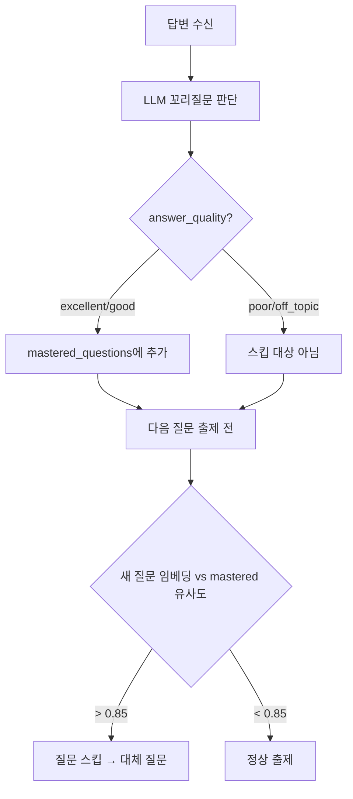

# ADR 066-070: 면접 질문 중복 방지 및 품질 개선

> **작성일:** 2026-02-19  
> **상태:** 승인됨 (Accepted)

---

## 📚 목차

- [ADR-066: 기술면접 질문 중복 방지 — 임베딩 유사도 + 답변 품질 평가](#adr-066-기술면접-질문-중복-방지--임베딩-유사도--답변-품질-평가)

---

## ADR-066: 기술면접 질문 중복 방지 — 임베딩 유사도 + 답변 품질 평가

### 📋 메타데이터

| 항목 | 내용 |
|------|------|
| **상태** | ✅ 승인됨 (Accepted) |
| **작성일** | 2026-02-19 |
| **결정자** | AI팀 |
| **관련 기능** | 기술면접, 꼬리질문 판단, VectorDB 임베딩 |
| **관련 ADR** | [ADR-065](4.DOCS/1.ADR/[AI]%2012_ADR_%20061-065.md#adr-065-임베딩-캐시-전략--cachebackedembeddings--localfilestore-도입) (임베딩 캐시), [ADR-054](4.DOCS/1.ADR/[AI]%2010_ADR_%20051-055.md#adr-054-rag-리트리버-확장-ragchainretrieve_context--mmr) (RAG 리트리버) |

---

### 🎯 컨텍스트 (Context)

현재 기술면접 시스템은 같은 채팅 세션 내에서 **이미 완벽하게 답변된 주제와 유사한 질문이 다시 출제될 수 있는 문제**가 있다.

**현재 상태:**

- `app/domain/interview/graph.py`의 `evaluate_answer()`에서 LLM이 `should_continue: true/false`만 반환
- `should_continue: false`의 의미가 모호함:
  - ✅ "답변이 완벽해서 더 파고들 필요 없음" → 유사 질문 스킵 대상
  - ❌ "답변을 못 해서 더 물어봐도 의미 없음" → 유사 질문 다시 출제 가능
- 두 경우가 동일하게 `question["is_completed"] = True`로 처리되어, **답변 품질에 따른 후속 처리 분기**가 불가능

**문제 시나리오:**

```
질문 1: "React의 가상 DOM 동작 원리를 설명해주세요" → 완벽히 답변
질문 3: "React의 렌더링 최적화 방법을 설명해주세요" → 유사 주제 중복 출제
```

**요구사항:**

1. 꼬리질문 판단 시 LLM이 답변 품질 등급을 함께 반환하도록 개선
2. 같은 세션 내에서 "완벽/양호 답변"한 질문과 유사도가 높은 새 질문은 스킵
3. "불량 답변"한 질문은 유사 질문이 다시 출제될 수 있도록 허용
4. 적용 범위: **같은 채팅 세션(같은 `session_id`)** 내에서만 동작

---

### 🏗️ 검토한 옵션

#### Option 1: LLM 답변 품질 등급 + 임베딩 유사도 필터링 (선택됨)

꼬리질문 판단 시 `answer_quality` 필드를 추가하고, 질문 출제 전 임베딩 유사도로 중복 필터링한다.

**1단계: followup 프롬프트 응답에 `answer_quality` 추가**

```yaml
# 현재 LLM 응답 포맷
{ "should_continue": false }

# 개선된 포맷
{
  "should_continue": false,
  "answer_quality": "excellent",  # excellent | good | poor | off_topic
  "quality_reason": "핵심 개념을 정확히 설명하고 실무 경험까지 언급"
}
```

| 등급 | 의미 | 유사 질문 스킵 |
|------|------|-------------|
| `excellent` | 핵심 + 심화까지 정확 | ✅ 스킵 |
| `good` | 핵심은 답변, 부분적 부족 | ✅ 스킵 |
| `poor` | 불완전하거나 부정확 | ❌ 유사 질문 허용 |
| `off_topic` | 질문과 무관한 답변 | ❌ 유사 질문 허용 |

**2단계: 세션 내 "마스터한 질문" 임베딩 수집**

```python
# InterviewSession 또는 세션 state에 추가
mastered_questions: list[dict] = []
# 형태: [{"question": "React 가상 DOM...", "embedding": [0.1, 0.2, ...]}]
```

- `answer_quality`가 `excellent` 또는 `good`이면 해당 질문을 `mastered_questions`에 추가
- 임베딩은 `CacheBackedEmbeddings`(ADR-065)로 생성 → 캐시 히트 시 API 비용 0

**3단계: 질문 출제 전 유사도 필터링**

```python
import numpy as np

async def filter_similar_questions(
    new_questions: list[dict],
    mastered_questions: list[dict],
    vectordb: VectorDBService,
    threshold: float = 0.85,
) -> list[dict]:
    """마스터한 질문과 유사한 새 질문을 필터링"""
    if not mastered_questions:
        return new_questions

    filtered = []
    mastered_embeddings = [q["embedding"] for q in mastered_questions]

    for q in new_questions:
        q_embedding = await vectordb.create_embedding(q["question"])
        max_sim = max(
            cosine_similarity(q_embedding, m_emb)
            for m_emb in mastered_embeddings
        )
        if max_sim < threshold:
            filtered.append(q)
        else:
            logger.info(f"질문 스킵 (유사도 {max_sim:.2f}): {q['question'][:50]}")

    return filtered
```



| 장점 | 단점 |
|------|------|
| 완벽 답변 주제의 불필요한 반복 제거 | followup 프롬프트 변경 필요 |
| 임베딩 캐시(ADR-065) 활용 → 추가 비용 최소 | 유사도 임계값 튜닝 필요 |
| 같은 세션 내에서만 동작 → 복잡도 낮음 | 세션 내 임베딩 비교 추가 연산 |
| 답변 품질에 따른 정밀한 분기 | LLM이 품질 등급을 정확히 판단하지 못할 수 있음 |

#### Option 2: 질문 텍스트 키워드 매칭만 사용

임베딩 없이 질문의 `category`, `keywords` 필드를 비교하여 중복을 판단한다.

| 장점 | 단점 |
|------|------|
| 구현 단순 | "React 가상 DOM" vs "React 렌더링 최적화"처럼 의미적 유사성 감지 불가 |
| 추가 API 비용 없음 | 카테고리가 같아도 질문 깊이가 다를 수 있음 |

#### Option 3: LLM에 이전 Q&A를 컨텍스트로 전달하여 중복 회피

질문 생성 시 이전 Q&A 전체를 프롬프트에 포함하고 "이미 답변된 주제는 피하라"고 지시한다.

| 장점 | 단점 |
|------|------|
| 별도 필터링 로직 불필요 | 프롬프트 길이 증가 → 토큰 비용 증가 |
| LLM이 자연스럽게 판단 | 판단이 불확실 (가끔 무시될 수 있음) |
| - | 5문 일괄 생성 시 적용 어려움 (이미 생성된 질문) |

---

### 결정 (Decision)

**Option 1 (LLM 답변 품질 등급 + 임베딩 유사도 필터링)을 선택합니다.**

**근거:**

1. **정밀한 분류**: `answer_quality` 등급으로 "잘 답해서 넘어감" vs "못 답해서 넘어감"을 명확히 구분. 기존 `should_continue` 단독 사용의 모호함을 해소.
2. **의미적 유사도**: 임베딩 기반 cosine similarity로 "React 가상 DOM" ↔ "React 렌더링 최적화" 같은 의미적 유사성을 감지. 키워드 매칭(Option 2)으로는 불가능.
3. **비용 효율**: `CacheBackedEmbeddings`(ADR-065) 덕분에 동일 질문 텍스트의 재임베딩 비용이 0. 세션 내 질문 수가 최대 5개라 비교 연산도 미미.
4. **범위 제한**: 같은 세션(`session_id`) 내에서만 `mastered_questions`를 유지하므로, 세션 종료 시 자연스럽게 리셋되어 복잡한 영속 로직 불필요.

---

### 구현 요약 (3.model 기준)

| 구분 | 파일 | 내용 |
|------|------|------|
| 프롬프트 수정 | `app/prompts/templates/interview/followup.md` | `answer_quality` + `quality_reason` 필드 추가 |
| 응답 파싱 | `app/domain/interview/graph.py` `evaluate_answer()` | `answer_quality` 파싱 → `excellent`/`good`이면 `mastered_questions`에 추가 |
| 유사도 필터 | `app/services/interview_dedup.py` [NEW] | `filter_similar_questions()` — 임베딩 cosine similarity 비교 |
| 세션 상태 | `app/domain/interview/entities.py` | `InterviewState`에 `mastered_questions` 필드 추가 |
| 질문 필터링 | `app/api/routes/v2/chat.py` | 질문 출제 전 `filter_similar_questions()` 호출 |

---

### Consequences (결과)

**긍정적 영향:**

- 같은 세션 내에서 이미 완벽히 답변한 주제의 중복 질문이 제거되어 면접 품질 향상
- 답변 품질 등급 데이터가 면접 리포트에도 활용 가능 (향후 확장)
- 임베딩 캐시(ADR-065)와 시너지: 질문 텍스트 임베딩 비용이 거의 0

**부정적 영향 / 트레이드오프:**

- followup 프롬프트 변경으로 LLM 응답 포맷이 복잡해짐. 파싱 실패 시 기본값(`good`) 적용 필요.
- cosine similarity 임계값(0.85)은 경험적 값. 너무 낮으면 다른 주제도 스킵되고, 너무 높으면 유사 질문이 통과될 수 있어 조정 필요.

**후속 작업:**

- [ ] followup 프롬프트에 `answer_quality` 필드 추가
- [ ] `evaluate_answer()`에서 `answer_quality` 파싱 로직 추가
- [ ] `InterviewState`에 `mastered_questions` 필드 추가
- [ ] `filter_similar_questions()` 유틸 함수 구현
- [ ] 질문 출제 경로에서 필터링 호출 연동
- [ ] cosine similarity 임계값 튜닝 (0.80~0.90 범위 실험)

---

### 이력

| 날짜 | 변경 내용 |
|------|----------|
| 2026-02-19 | 초기 작성 (답변 품질 등급 + 임베딩 유사도 중복 방지 결정) |
